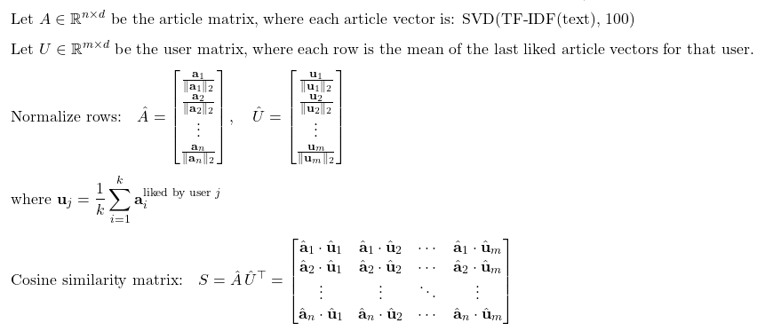

# TF-IDF

## Experimenting with Normal TF-IDF

1. lots of zeroes
19k dimensions invalid for cosine

2. reducing dim make most of the vectors zeroes as well

## Experimenting with SVD + TF-IDF

better approach

| # | First Text (Reference)                                                                 | Second Text (Paraphrased)                                                                                           | **Cosine Similarity** |
| - | -------------------------------------------------------------------------------------- | ------------------------------------------------------------------------------------------------------------------- | --------------------- |
| 1 | Palestinian citizens of Israel express fear and distrust over a fragile Gaza ceasefire | Palestinian citizens of Israel voice concern and mistrust amid a fragile Gaza truce.                                | **0.9650**            |
| 2 | Palestinian citizens of Israel express fear and distrust over a fragile Gaza ceasefire | Palestinian citizens in Israel express anxiety and skepticism over the fragile ceasefire in Gaza.                   | **0.9998**            |
| 3 | Palestinian citizens of Israel express fear and distrust over a fragile Gaza ceasefire | Amid a tenuous Gaza truce, Palestinian Israelis share feelings of fear and distrust.                                | **0.8151**            |
| 4 | Palestinian citizens of Israel express fear and distrust over a fragile Gaza ceasefire | Palestinian residents of Israel voice unease and doubt about the shaky Gaza ceasefire.                              | **0.9978**            |
| 5 | Palestinian citizens of Israel express fear and distrust over a fragile Gaza ceasefire | In Israel, many Palestinian citizens say they feel fearful and suspicious during the fragile Gaza truce.            | **0.9477**            |
| 6 | Palestinian citizens of Israel express fear and distrust over a fragile Gaza ceasefire | With the Gaza ceasefire on edge, Palestinian residents of Israel express rising unease.                             | **0.9961**            |
| 7 | Palestinian citizens of Israel express fear and distrust over a fragile Gaza ceasefire | Many Palestinian Israelis worry that the Gaza ceasefire will not hold, reflecting deep mistrust toward the process. | **0.9257**            |
| 8 | Palestinian citizens of Israel express fear and distrust over a fragile Gaza ceasefire |  Amid fragile peace efforts, Palestinian Israelis express mixed feelings of hope and doubt. | **0.2834** |
| 9 | Palestinian citizens of Israel express fear and distrust over a fragile Gaza ceasefire | Doubts rise over the recent pause in violence, especially among groups already feeling marginalized. | **0.1372** |
| 10 | Palestinian citizens of Israel express fear and distrust over a fragile Gaza ceasefire | Analysts note that fragile diplomatic efforts have failed to reassure local populations affected by the conflict. | **0.3279** |

## Summary

